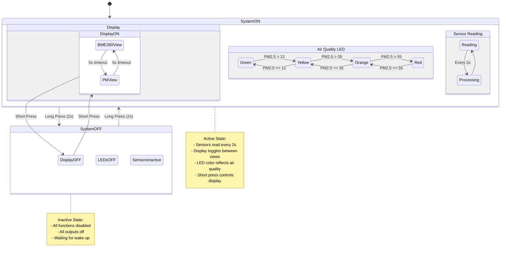

# Air Purifier State Machine Diagram

```mermaid
stateDiagram-v2
    [*] --> SystemON

    state SystemON {
        state Display {
            DisplayON --> DisplayOFF: Short Press
            DisplayOFF --> DisplayON: Short Press
            
            state DisplayON {
                BME280View --> PMView: 5s timeout
                PMView --> BME280View: 5s timeout
            }
        }

        state "Air Quality LED" as LED {
            direction LR
            Green --> Yellow: PM2.5 > 12
            Yellow --> Orange: PM2.5 > 35
            Orange --> Red: PM2.5 > 55
            Red --> Orange: PM2.5 <= 55
            Orange --> Yellow: PM2.5 <= 35
            Yellow --> Green: PM2.5 <= 12
        }

        state "Sensor Reading" as Sensor {
            Reading --> Processing: Every 2s
            Processing --> Reading
        }
    }

    state SystemOFF {
        DisplayOFF
        LEDsOFF
        SensorsInactive
    }

    SystemON --> SystemOFF: Long Press (2s)
    SystemOFF --> SystemON: Long Press (2s)

    note right of SystemON
        Active State:
        - Sensors read every 2s
        - Display toggles between views
        - LED color reflects air quality
        - Short press controls display
    end note

    note right of SystemOFF
        Inactive State:
        - All functions disabled
        - All outputs off
        - Waiting for wake up
    end note
```