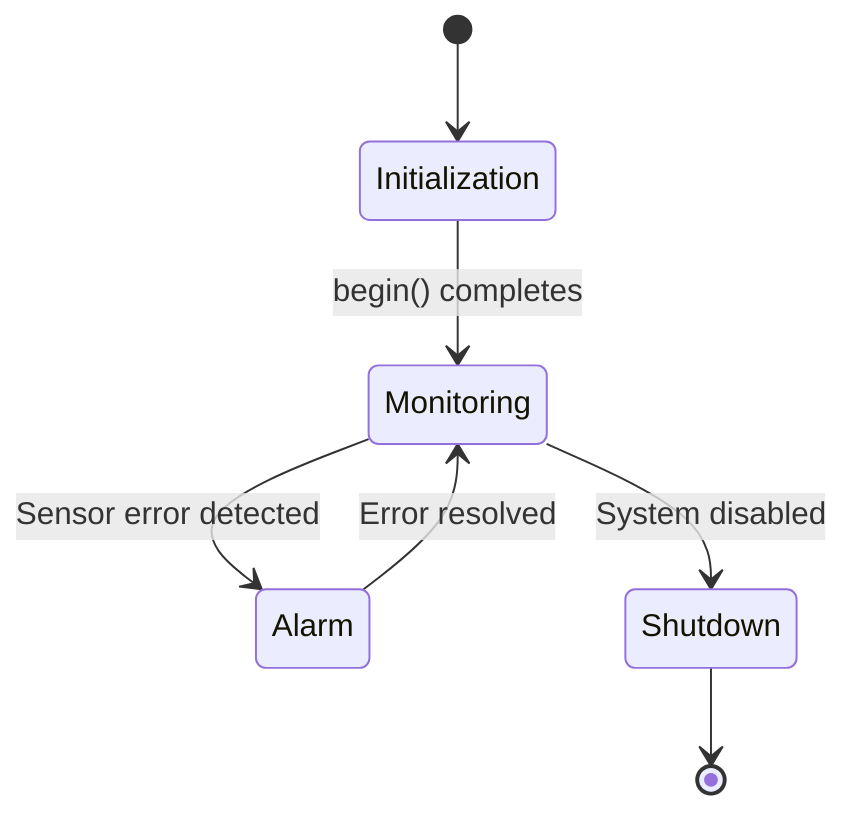
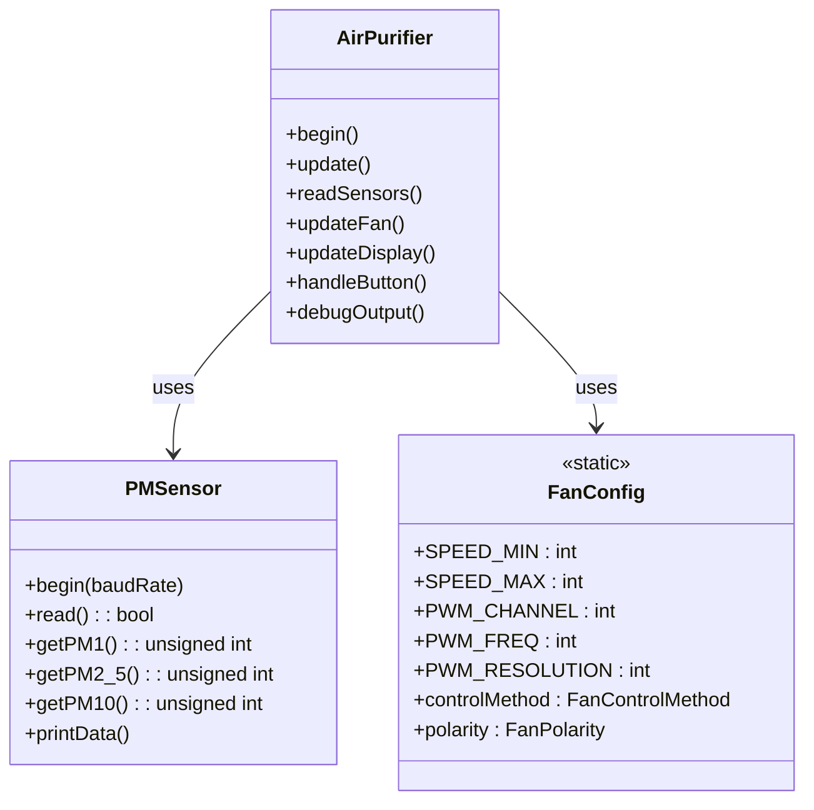
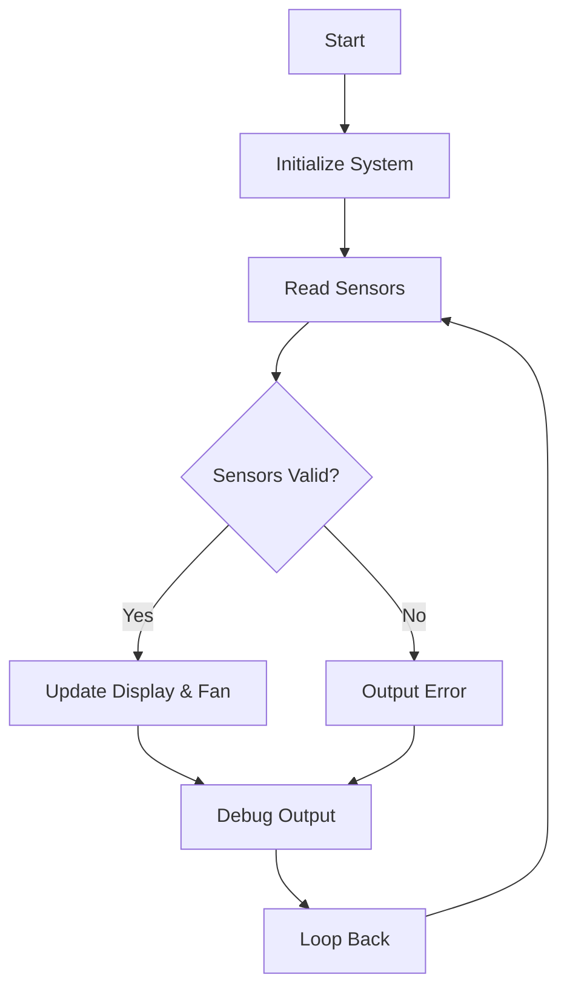

# ESP32 Air Purifier Project

## Overview

This project is designed to manage an air purifier system using an ESP32 microcontroller. It integrates multiple sensors, controls a fan (PWM/Digital), and interfaces with an LCD display.

## Features

- **Environmental Monitoring:** Measures temperature, humidity, pressure, and PM1.0, PM2.5, PM10 levels.
- **Display:** Shows sensor data and system status on a 16x2 I2C LCD.
- **LED Indicators:** Uses an RGB LED module with pin order: Green, Blue, Red.
- **Fan Control:** Supports both digital and PWM control methods.
- **User Interface:** A single button is used for toggling display modes and powering the system on/off.
- **State Machine Operation:** Utilizes state diagrams to manage display and system states.
- **PlatformIO Integration:** Fully configured project using PlatformIO with the Arduino framework.

## Hardware Requirements

- ESP32 development board (e.g., DOIT ESP32 DEVKIT V1)
- BME280 sensor module
- Particulate Matter sensor (PMSensor)
- I2C LiquidCrystal display (16x2)
- RGB LED module (with pin order: Green, Blue, Red)
- Fan (compatible with digital and PWM control)
- Button for user input and debouncing circuitry (if needed)
- Appropriate wiring and power supply

## Software Requirements

- PlatformIO installed on your Windows machine with Visual Studio Code
- Arduino framework for ESP32
- Required libraries (specified in `platformio.ini`):
  - LiquidCrystal_I2C
  - Adafruit BME280 Library
  - EspSoftwareSerial

## Installation & Setup

1. **Clone or Download the Project:**  
   Copy the project files to your local machine.

2. **Open in Visual Studio Code:**  
   Open the project folder in VS Code with PlatformIO installed.

3. **Configure PlatformIO:**  
   Verify that the `platformio.ini` file is set up for your board:

   ```ini
   [env:esp32doit-devkit-v1]
   platform = espressif32
   board = esp32doit-devkit-v1
   framework = arduino
   lib_deps = 
       marcoschwartz/LiquidCrystal_I2C@^1.1.4
       adafruit/Adafruit BME280 Library@^2.2.4
       plerup/EspSoftwareSerial@^8.2.0
   ```

4. **Build and Upload:**  
   - **Build:** Use the PlatformIO build command (Ctrl+Alt+B).
   - **Upload:** Use the PlatformIO upload command (Ctrl+Alt+U).
   - **Serial Monitor:** Open the serial monitor (Ctrl+Alt+M) to view debug output.

## How to Use

1. **Power On and Initialization:**  
   After uploading the code, power on the ESP32. The LCD will show an initialization message before switching to the active display.

2. **Sensor Data Display:**  
   - The system alternates between showing BME280 data (temperature, humidity, pressure) and PMSensor data (PM1.0, PM2.5, PM10).
   - The display automatically toggles views based on a timed interval.

3. **Fan and LED Operation:**  
   - The fan is controlled via digital or PWM signals based on the configuration in `FanConfig.h`.
   - LED colors change to reflect air quality: green (good), blue (moderate), red (bad).

4. **User Interaction:**  
   - **Short Press:** Toggles the display (switches between display views).
   - **Long Press (approx. 2 seconds):** Changes the system state (power on/off).
   - Refer to the project’s state machine diagrams (e.g., in `# Air Purifier State Machine Diagram.md` and `button_state_machine.md`) for detailed control flow.

## Diagrams

Below are various diagrams for visualizing system components. You can add more diagram types or remove any that are unnecessary.

### State Machine Diagram



### Class UML Diagram



### Flow Diagram



### Tree Diagram (Project Structure)

```plaintext
.
├── include
│   └── PMSensor.h
├── src
│   ├── AirPurifier.cpp
│   ├── FanConfig.cpp
│   ├── main.cpp
│   └── PMSensor.cpp
└── platformio.ini
```

## Troubleshooting

- **Sensor Detection Issues:**  
  If the BME280 does not initialize, check the wiring and ensure the correct I2C address.
- **Display Problems:**  
  Verify the I2C LCD address and connection.
- **Fan Control:**  
  Confirm PWM channel and polarity settings in the fan configuration header.
- **Button Responsiveness:**  
  Adjust debounce timing in code if necessary.

## Additional Information

For further details and design insights, refer to the accompanying state machine diagrams and documentation files in the project folder.

Happy building!
