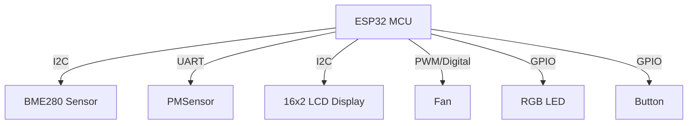
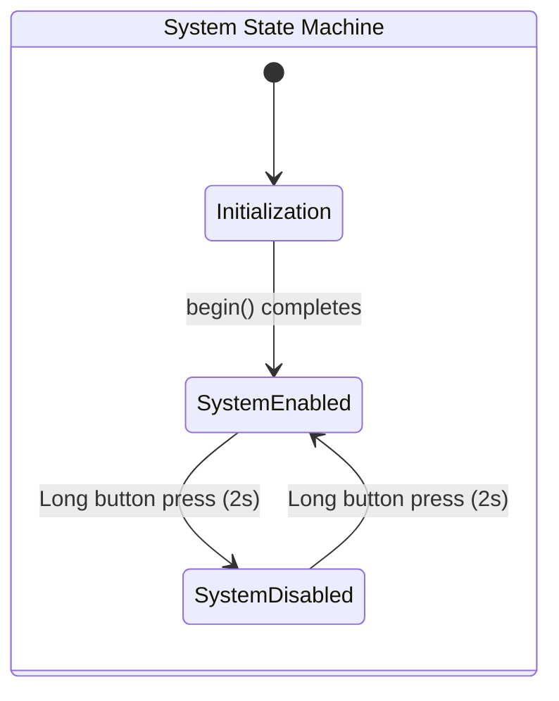
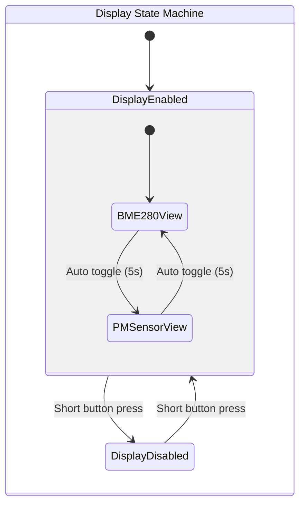
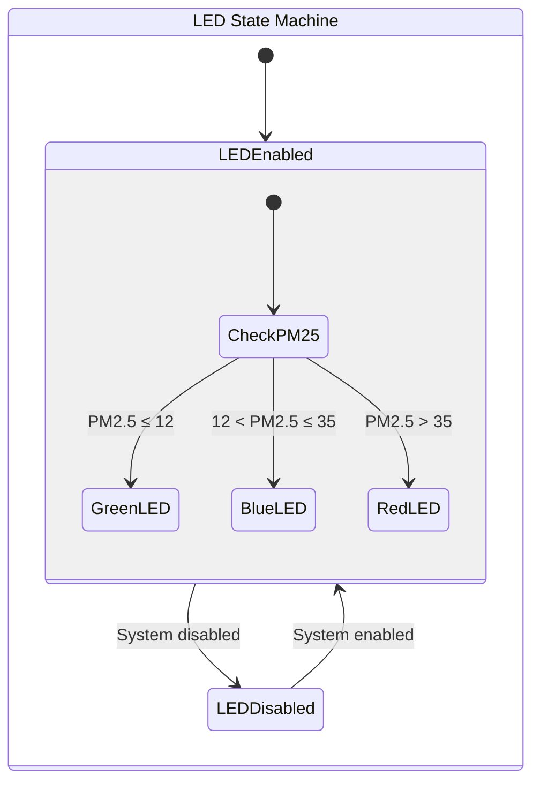
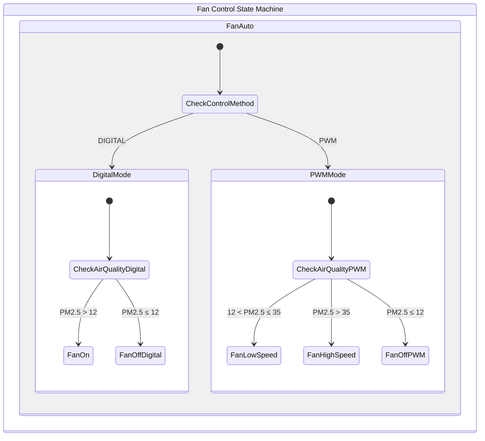
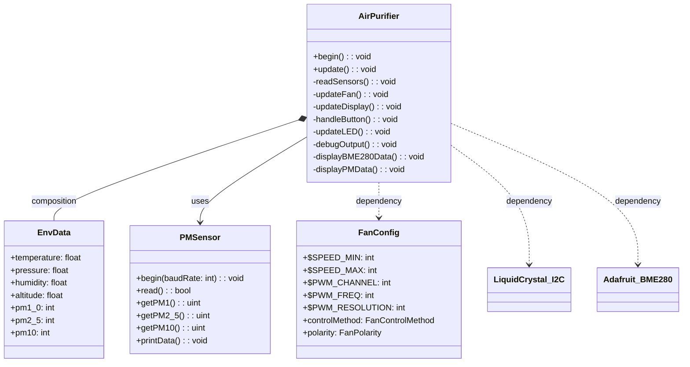

# ESP32 Air Purifier Project

## Table of Contents

- [Overview](#overview)
- [Features](#features)
- [Hardware Requirements](#hardware-requirements)
- [Software Requirements](#software-requirements)
- [Installation & Setup](#installation--setup)
- [How to Use](#how-to-use)
- [System Architecture](#system-architecture)
  - [Hardware Block Diagram](#hardware-block-diagram)
  - [State Machine Diagram](#state-machine-diagram)
  - [Class UML Diagram](#class-uml-diagram)
- [Troubleshooting](#troubleshooting)
- [Contributing](#contributing)
- [License](#license)

## Overview

This project is designed to manage an air purifier system using an ESP32 microcontroller. It integrates multiple sensors, controls a fan (PWM/Digital), and interfaces with an LCD display. The system is designed for both standalone operation and remote monitoring.

## Features

- **Environmental Monitoring:** Measures temperature, humidity, pressure, and PM1.0, PM2.5, PM10 levels.
- **Display:** Shows sensor data and system status on a 16x2 I2C LCD.
- **LED Indicators:** Uses an RGB LED module with pin order: Green, Blue, Red.
- **Fan Control:** Supports both digital and PWM control methods.
- **User Interface:** A single button is used for toggling display modes and powering the system on/off.
- **State Machine Operation:** Utilizes state diagrams to manage display and system states.
- **PlatformIO Integration:** Fully configured project using PlatformIO with the Arduino framework.

## Hardware Requirements

- ESP32 development board (e.g., DOIT ESP32 DEVKIT V1)
- BME280 sensor module
- Particulate Matter sensor (PMSensor)
- I2C LiquidCrystal display (16x2)
- RGB LED module (with pin order: Green, Blue, Red)
- **If using a DC motor, I recommend using PWM controller support.**
- **If using an AC motor, I recommend using a VFD with PWM control.**
- **If using just a relay with an AC/DC motor, you must use Digital Mode. The fan speed will be fixed at full speed while the fan is turned on, and you will only have on/off control without RPM adjustment.**
- Button for user input and debouncing circuitry (if needed)
- Appropriate wiring and power supply

## Software Requirements

- PlatformIO installed on your Windows machine with Visual Studio Code.
- Arduino framework for ESP32.
- Required libraries (specified in `platformio.ini`):
  - LiquidCrystal_I2C
  - Adafruit BME280 Library
  - EspSoftwareSerial

## Installation & Setup

1. **Clone or Download the Project:**  
   Copy the project files to your local machine.

2. **Open in Visual Studio Code:**  
   Open the project folder in VS Code with PlatformIO installed.

3. **Configure PlatformIO:**  
   Verify that the `platformio.ini` file is set up for your board:

   ```ini
   [env:esp32doit-devkit-v1]
   platform = espressif32
   board = esp32doit-devkit-v1
   framework = arduino
   lib_deps = 
       marcoschwartz/LiquidCrystal_I2C@^1.1.4
       adafruit/Adafruit BME280 Library@^2.2.4
       plerup/EspSoftwareSerial@^8.2.0
   ```

4. **Build and Upload:**  
   - **Build:** Use the PlatformIO build command (Ctrl+Alt+B).
   - **Upload:** Use the PlatformIO upload command (Ctrl+Alt+U).
   - **Serial Monitor:** Open the serial monitor (Ctrl+Alt+M) to view debug output.

## How to Use

1. **Power On and Initialization:**  
   After uploading the code, power on the ESP32. The LCD will show an initialization message before switching to the active display.

2. **Sensor Data Display:**  
   - The system alternates between showing BME280 data (temperature, humidity, pressure) and PMSensor data (PM1.0, PM2.5, PM10).
   - The display automatically toggles views based on a timed interval (5 seconds).

3. **Fan and LED Operation:**  
   - The fan is controlled via digital or PWM signals based on the configuration in `FanConfig.h`.
   - The fan speed automatically adjusts based on particulate matter readings.
   - LED colors change to reflect air quality: green (good, PM2.5 ≤ 12), blue (moderate, PM2.5 ≤ 35), red (bad, PM2.5 > 35).

4. **User Interaction:**  
   - **Short Press:** Toggles the display (switches between display enabled/disabled).
   - **Long Press (approximately 2 seconds):** Changes the system state (power on/off).

## System Architecture

### Hardware Block Diagram



### State Machine Diagram

The air purifier implements multiple state machines to manage different aspects of the system:









The system implements these interconnected state machines to manage the display, LED indicators, and fan control based on sensor readings and user input. The button interface uses both short presses (to toggle display state) and long presses (to toggle system power).

### Class UML Diagram



## Troubleshooting

- **Sensor Detection Issues:**  
  If the BME280 does not initialize, check the wiring and ensure the correct I2C address (0x76 used in this project).
- **Display Problems:**  
  Verify the I2C LCD address (0x27 used in this project) and connection.
- **Fan Control:**  
  Confirm PWM channel and polarity settings in the fan configuration header. The system supports both ACTIVE_HIGH and ACTIVE_LOW fan polarities.
- **Button Responsiveness:**  
  If button is not responsive, adjust debounce timing in TimingConfig (currently set to 50ms debounce delay).
- **Particulate Matter Readings:**  
  If PM sensor readings are inconsistent, check serial connections and ensure the sensor is properly powered.

## Contributing

Contributions are welcome! Please fork the repository, create a feature branch, and submit a pull request with your changes.

## License

This project is licensed under the MIT License.
