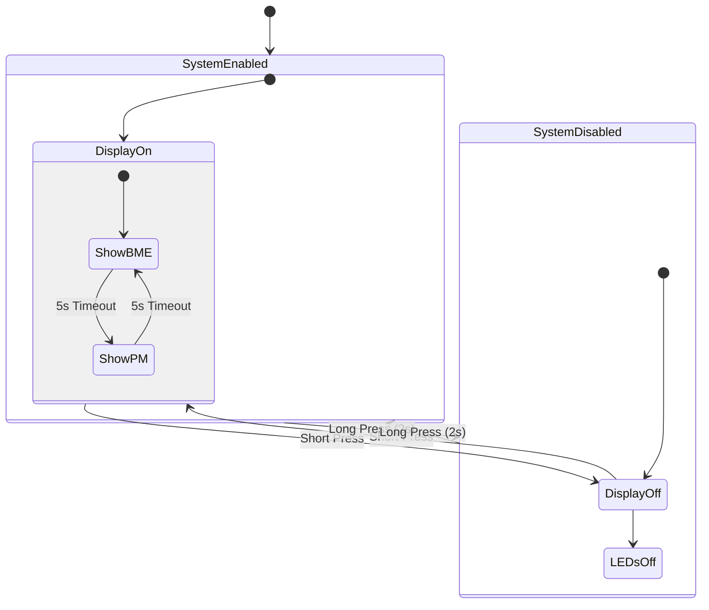

```mermaid
stateDiagram-v2
    [*] --> SystemEnabled

    state SystemEnabled {
        [*] --> DisplayOn
        DisplayOn --> DisplayOff: Short Press
        DisplayOff --> DisplayOn: Short Press

        state DisplayOn {
            [*] --> ShowBME
            ShowBME --> ShowPM: 5s Timeout
            ShowPM --> ShowBME: 5s Timeout
        }
    }

    SystemEnabled --> SystemDisabled: Long Press (2s)
    SystemDisabled --> SystemEnabled: Long Press (2s)

    state SystemDisabled {
        [*] --> DisplayOff
        DisplayOff --> LEDsOff
    }
```